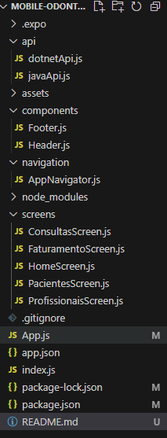

# Odontoprev App

GABRIEL TORRES FERNANDES - RM553635

## Descrição

O **Odontoprev App** é um aplicativo mobile desenvolvido em React Native que integra duas APIs (C# .NET e Java) para gerenciamento de dados odontológicos. O app possui 5 telas principais para exibir informações de Consultas, Faturamento, Pacientes e Profissionais, além de uma tela inicial de navegação. Componentes reutilizáveis (Header e Footer) foram criados para garantir consistência na interface.

## Funcionalidades

- **Home:** Tela inicial com botões para navegar às demais funcionalidades.
- **Consultas:** Exibição de consultas (integração com API .NET).
- **Faturamento:** Exibição dos dados de faturamento (integração com API .NET).
- **Pacientes:** Listagem de pacientes (integração com API Java).
- **Profissionais:** Listagem de profissionais (integração com API Java).
- **Componentes Comuns:** Header e Footer para consistência visual.

## Estrutura de pastas


## Pré-requisitos

- [Node.js](https://nodejs.org/) (versão 14 ou superior recomendada)
- [Expo CLI](https://docs.expo.dev/) ou React Native CLI
- Android Studio e/ou Xcode (para emuladores ou dispositivos)
- Endpoints das APIs C# .NET e Java configurados

## Instalação e Configuração

1. **Clone o Repositório:**

   ```bash
   git clone <https://github.com/gabrieltf1901/MOBILE-ODONTOPREV.git>
   cd MOBILE-ODONTOPREV
   ```

2. **Instale as depêndencias:**

    ```bash 
    npm install
    ```

    ```bash 
    npm install @react-navigation/native @react-navigation/stack react-native-screens react-native-safe-area-context
    ```

    ```bash 
    npm install axios
    ```

3. **Configure as URLs das APIs:**

- No arquivo api/dotnetApi.js, atualize a variável API_URL com o endpoint da API C# (.NET).

- No arquivo api/javaApi.js, atualize a variável API_URL com o endpoint da API Java.

## Executando o Projeto

1. Inicie o Metro Bundler com cache limpo:

    ```bash
    npm start -c
    ```

2. No terminal, pressione:

- A para abrir no emulador Android.

- Utilize o aplicativo Expo Go no seu dispositivo.

## Estrutura e Componentes do Projeto

- /api/: Arquivos de integração com as APIs (dotnetApi.js e javaApi.js).

- /components/: Componentes reutilizáveis (Header.js e Footer.js).

- /screens/: Telas do aplicativo (HomeScreen, ConsultasScreen, FaturamentoScreen, PacientesScreen e ProfissionaisScreen).

- /navigation/AppNavigator.js: Configuração do React Navigation para gerenciar a navegação entre telas.

- App.js: Ponto de entrada do aplicativo.

## Possíveis Problemas e Soluções
- Erro "Unable to resolve":
Verifique se a estrutura de pastas e a capitalização dos nomes dos arquivos estão corretos.
Caso o erro persista, tente limpar o cache com:

```bash
expo start -c
```

- Dispositivo/Emulador Não Detectado:
Certifique-se de que o emulador esteja ativo ou que um dispositivo físico esteja conectado com a depuração USB habilitada.

- Configuração das APIs:
Confirme se os endpoints configurados nos arquivos dotnetApi.js e javaApi.js estão corretos e ativos.

## Conclusão
Este projeto foi desenvolvido com uma abordagem modular, visando facilitar a manutenção e a escalabilidade. Siga os passos acima para configurar e executar o Odontoprev App sem erros. Se surgirem dúvidas, consulte a documentação oficial do React Native e do Expo.


